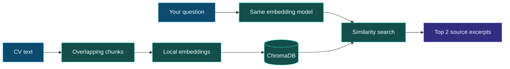

<div align="center">


**A CV you can query. Source text you can inspect.**

A local document-retrieval demo exploring the foundations of RAG.<br/>
Built with Python, ChromaDB, and local embeddings.

<p>
  
  
  
  
</p>

<p>
  <a href="#quick-start">Quick start</a> &nbsp;·&nbsp;
  <a href="#inside-the-pipeline">How it works</a> &nbsp;·&nbsp;
  <a href="#try-these-questions">Example questions</a> &nbsp;·&nbsp;
  <a href="#design-notes">Design notes</a>
</p>


<a href="LICENSE"></a>

</div>

---

## The idea

A CV contains the answers. The challenge is finding the right passage.

Ask about experience, technical skills, education, or projects. The app searches the CV and prints the **two closest matching excerpts** by default, making it easy to inspect the source behind each result.

> **What this project demonstrates:** the retrieval foundation of a RAG system. This version returns source excerpts directly; it does not use an LLM to generate answers.

## At a glance

| Capability | What happens |
| :--- | :--- |
| **Natural-language queries** | Ask a question instead of scanning the whole CV. |
| **Local semantic embeddings** | ChromaDB's default MiniLM model represents text as vectors via ONNX. |
| **Automatic fallback** | If the embedding model fails to load, a TF-IDF vectorizer uses the CV's vocabulary. |
| **Inspectable results** | Retrieved passages are printed directly from the indexed text. |
| **On-disk vector storage** | ChromaDB stores the collection locally in `chroma_db/`. |
| **Ready-to-run demo** | Four sample questions run before the interactive prompt opens. |

## Inside the pipeline



| Stage | Implementation |
| :--- | :--- |
| **01 · Prepare** | Read `data/cv.txt` and normalize whitespace. |
| **02 · Chunk** | Split into 500-character windows with a 100-character overlap. |
| **03 · Embed** | Use `all-MiniLM-L6-v2`, or fit a TF-IDF vectorizer on the chunks. |
| **04 · Index** | Recreate the local ChromaDB collection and add the document vectors. |
| **05 · Retrieve** | Embed the question, search the collection, and print the top matches. |

### Two embedding paths

| | Semantic path | Fallback path |
| :--- | :--- | :--- |
| **Model** | MiniLM through ONNX | scikit-learn TF-IDF |
| **Matching** | Learned text representations | Vocabulary-based matching |
| **Model download** | Required on first use unless cached | No pretrained weights needed |
| **Execution** | Local after model setup | Local after dependency setup |
| **Selection** | Tried first | Used if the semantic model fails |

## Quick start

Use **Python 3.11** for the setup below. Run commands from the repository root.

```bash
git clone https://github.com/layankhayyat04-ui/cv-rag-chatbot.git
cd cv-rag-chatbot
python -m venv .venv
```

<details>
<summary><strong>Activate your virtual environment</strong></summary>

**Windows PowerShell**

```powershell
.venv\Scripts\Activate.ps1
```

**macOS / Linux**

```bash
source .venv/bin/activate
```

</details>

Install the dependencies and start the app:

```bash
python -m pip install -r requirements.txt
python app.py
```

The app indexes the CV, runs four example questions, then accepts your own questions. **Press Enter on an empty prompt to exit.**

To run just the sample questions:

```bash
python app.py --demo-only
```

> On first use, the semantic model may download its weights. If loading fails, the app attempts the local TF-IDF fallback.

## Try these questions

```text
What Business Intelligence experience does this candidate have?
What programming languages does this candidate know?
What projects has this candidate built?
What is this candidate's education background?
```

Each question produces ranked source passages. The result depends on the CV text and the embedding path in use.

<details>
<summary><strong>View the existing terminal demo</strong></summary>


</details>

## Make it your own

1. Replace the contents of [`data/cv.txt`](data/cv.txt) with your CV or another plain-text document.
2. Run `python app.py` again to rebuild the collection.
3. Ask questions about the new document.

The indexing and retrieval settings live in [`app.py`](app.py):

| Setting | Default | Purpose |
| :--- | :--- | :--- |
| `chunk_size` | `500` | Characters per text window |
| `overlap` | `100` | Characters shared between adjacent windows |
| `top_k` | `2` | Number of retrieved passages |
| `collection_name` | `cv_chunks` | Local ChromaDB collection name |

Keep `0 <= overlap < chunk_size` when changing the chunking settings.

## Repository map

```text
cv-rag-chatbot/
├── app.py              # Chunking, embeddings, indexing, and terminal Q&A
├── data/
│   └── cv.txt          # Source document
├── docs/
│   ├── banner.png      # Existing project artwork
│   └── demo.png        # Existing terminal demo
├── requirements.txt    # Python dependencies
├── .gitignore
├── LICENSE
└── README.md
```

## Design notes

- **Retrieval, without generated answers.** Results are excerpts, so their wording can be checked against the document. Retrieval can still return an irrelevant passage.
- **Character-based chunking.** Overlap provides shared context, but does not guarantee intact sentences or words at every boundary.
- **No “answer not found” threshold.** The app returns the nearest matches even when the CV does not contain the requested information.
- **Scores are not confidence percentages.** The current terminal output labels `1 - distance` as a similarity score; interpret it in the context of the underlying distance metric.
- **Fresh index on each run.** The named collection is recreated at startup, rather than incrementally updated.

## Possible extensions

Ideas for a future version:

- [ ] Generated answers grounded in retrieved passages
- [ ] A web interface for asking questions
- [ ] Sentence-aware chunking and source metadata
- [ ] Retrieval evaluation and handling for unanswered questions

---

<div align="center">

**Built by [Layan Khayyat](https://github.com/layankhayyat04-ui)**

Explore more: [BMS Dashboard](https://github.com/layankhayyat04-ui/bms-dashboard) · [E-commerce SQL & Python Analysis](https://github.com/layankhayyat04-ui/ecommerce-sql-python-analysis)


[MIT licensed](LICENSE)

</div>
